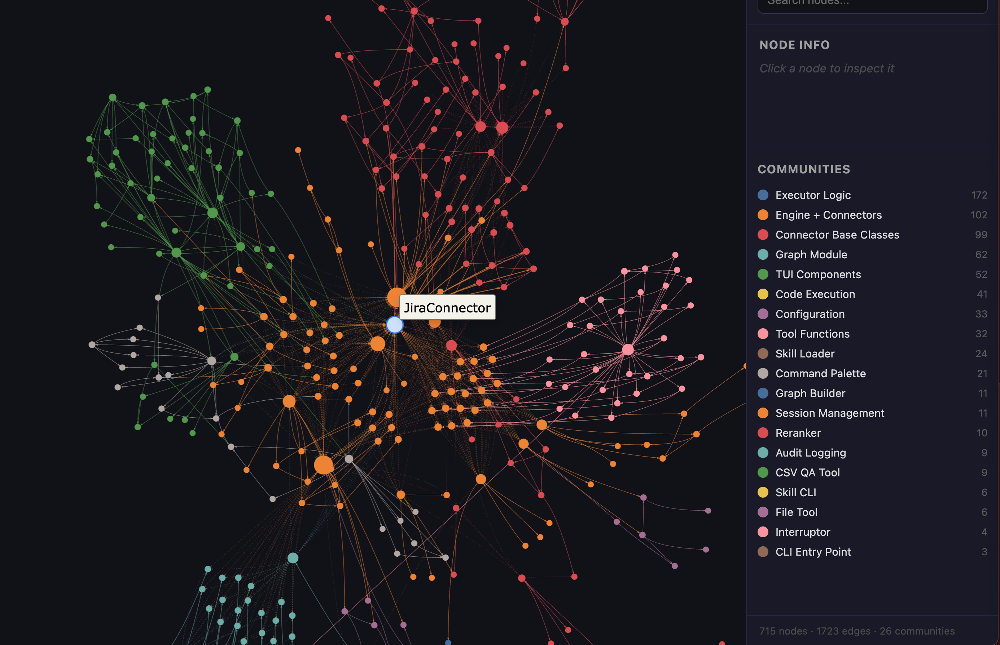

# Shane Skills


**A modular toolkit and agentic skill-set for GitHub Copilot and OpenCode developers.**

---

**Shane Skills** is a high-performance, developer-centric CLI and TUI suite designed to bridge the gap between AI coding assistants and corporate engineering ecosystems. It provides a standardized layer for interacting with **Jira**, **Confluence**, **Oracle/SQL Databases**, and **Web content**, while hosting specialized **AI Agents** for complex tasks like JDK migrations and security reviews.

---

### 🧠 Core Capabilities

*   **Secure Credential Management**: Integration with the OS Keychain (`keyring`) ensures that sensitive tokens for Jira, Confluence, and Database passwords never touch plain-text config files.
*   **Dual Interface Model**:
    *   **CLI**: Optimized for AI Agents (Copilot/OpenCode) to execute atomic tasks.
    *   **TUI**: A rich, interactive terminal interface for humans to manage configurations and test connections.
*   **Read-Only Data Safety**: The Database skill features a strict SQL parser that blocks DML/DDL (INSERT/UPDATE/DELETE) to ensure zero-risk data exploration.
*   **Markdown-First Design**: All tool outputs are automatically converted to clean, AI-friendly Markdown for immediate context injection.

---

### 🛠️ Supported Skills

The following skills are available as atomic CLI commands under `shane-skills <skill>`.

| Skill | Category | Capabilities |
| :--- | :--- | :--- |
| **Jira** | Project Management | Fetch issues, JQL search, full-text search, and issue creation. |
| **Confluence** | Documentation | Search by CQL, recursive page fetching, and automated page creation. |
| **Database** | Data Exploration | Read-only access to **Oracle**, **PostgreSQL**, and **MySQL**. Schema discovery & table description. |
| **Web Fetch** | Intelligence | Convert any URL (documentation, wikis) into clean Markdown context. |
| **Python** | Standards | Integrated best practices for type hints, ruff linting, and async testing. |
| **Browser** | E2E Automation | Control a live Chrome browser via `browser-harness` for E2E testing of internal web apps. |
| **Graph Build** | Intelligence | Build a knowledge graph from any folder of files. Generates clustered communities, HTML, JSON, and a report. (`/graphify`) |
| **Graph Query** | Intelligence | Query a graphify knowledge graph to traverse, explain nodes, or find shortest paths. (`/graphify query`) |

---

### 🤖 Specialized Agents

Shane Skills hosts a library of "Agent Personas" located in `skills/agents/`. These are optimized for high-reasoning tasks:

#### 1. JDK Upgrade Agent (`jdk-upgrade`)
Automates the migration of legacy Java projects:
*   **OpenJDK 8 → 17** migration path.
*   **Spring Boot 2.x → 3.x** API compatibility fixes.
*   Automated `pom.xml` dependency resolution and Jakarta EE package migration.
*   Iterative "Compile → Fix → Verify" loop.

#### 2. Code Review Agent (`code-review`)
Performs thorough reviews against HSBC engineering standards:
*   **Security**: Detects hardcoded secrets and SQL injection patterns.
*   **Quality**: Enforces SOLID principles, DRY, and strict type hinting.
*   **Testing**: Validates unit test coverage for new logic.

#### 3. GraphRAG Agent (`graph-rag`)
Knowledge graph RAG agent — builds a graph from any corpus, then answers questions by traversing it.
*   **Graph Creation**: Uses the `graph-build` skill to extract, cluster, and visualize any corpus into a knowledge graph.
*   **Graph Traversal**: Uses the `graph-query` skill to answer questions, explain nodes, and trace paths through an existing graph.
*   **Accuracy**: Never re-reads source files to answer questions, relying on the graph first. Always cites sources and never invents connections.

#### 4. Browser Automation Agent (`automation`)
Drives a live Chrome browser session to execute E2E testing workflows using the `browser` skill.
*   **Screenshot-driven**: Captures viewport state before and after each action to verify results.
*   **Tab management**: Opens isolated tabs per test to avoid contaminating other sessions.
*   **Dialog handling**: Detects and dismisses `alert`, `confirm`, `prompt`, and `beforeunload` dialogs via CDP.

---

### ⚙️ Installation & Setup

**1. Install from Source**
```bash
git clone https://github.com/coin1860/shane-skills.git
cd shane-skills
python3 -m venv .venv
source .venv/bin/activate
pip install .
```

**2. Configure the Toolkit**
Launch the interactive configuration TUI:
```bash
shane-skills config
```
*   Use the **Atlassian** tab to set up Jira/Confluence URLs and tokens.
*   Use the **Databases** tab to configure your "default" connection (Oracle, PG, etc.).
*   Passwords are automatically moved to your OS Keychain upon saving.

---

### 🚀 Usage Examples

**Database Exploration**
```bash
shane-skills db schema              # See all tables
shane-skills db describe EMPLOYEES   # View column definitions
shane-skills db query "SELECT count(*) FROM EMPLOYEES"
```

**Atlassian Integration**
```bash
shane-skills jira fetch FSR-123      # Get full context of a ticket
shane-skills confluence search "K8s" # Find internal docs
```

**Web Intelligence**
```bash
shane-skills web fetch https://docs.python.org/3/library/asyncio.html
```

---

### 🕸️ Knowledge Graph (Graphify)

The `graph-build` and `graph-query` skills power a full **GraphRAG pipeline** — turn any folder of files into a navigable, queryable knowledge graph.



#### Pipeline Overview

```
/graphify <path>          # Full build: detect → extract → cluster → report + HTML
/graphify <path> --update # Incremental: re-extract only new/changed files
/graphify <path> --no-viz # Skip visualization, just report + JSON
/graphify <path> --wiki   # Also generate an agent-crawlable wiki
```

The pipeline produces three outputs in `graphify-out/`:

| Output | Description |
| :--- | :--- |
| `graph.json` | GraphRAG-ready node-link JSON, queryable by `/graphify query` |
| `graph.html` | Interactive visualization — open in any browser |
| `GRAPH_REPORT.md` | Plain-language architecture summary with God Nodes & Surprising Connections |
| `wiki/` | Agent-crawlable wiki articles (only with `--wiki`) |

#### Build Pipeline Steps

The `graph-build` skill (`skills/skills/graph-build/skill.md`) drives a **6-step pipeline**:

| Step | What Happens |
| :--- | :--- |
| **1 — Install** | Ensures `graphify` is installed; records the Python interpreter path. |
| **2 — Detect** | Scans the corpus directory; counts files and words per type (code, docs, papers, images). Stops if empty; warns if corpus is too large. |
| **3 — Extract** | Runs **structural extraction** (AST, free) for code files, then **semantic extraction** (AI, costs tokens) for docs/papers. Checks a local cache before dispatching subagents. |
| **4 — Build & Cluster** | Merges all nodes/edges into a `networkx` graph, runs community detection, identifies *God Nodes* and *Surprising Connections*. |
| **5 — Label Communities** | Agent reads cluster membership and writes 2–5 word plain-language names per community. |
| **6 — Report & Visualize** | Writes `GRAPH_REPORT.md` (with suggested questions) and `graph.html` (interactive force-directed layout). |

> **Note:** All commands use `python -c "..."` syntax — compatible with Windows PowerShell, macOS, and Linux.

#### Querying the Graph

Once a graph exists at `graphify-out/graph.json`, use the `graph-query` skill:

```
/graphify query "<question>"          # BFS traversal — broad context
/graphify query "<question>" --dfs    # DFS — trace a specific dependency chain
/graphify query "<question>" --budget 1500  # Cap answer at N tokens
/graphify explain "<node name>"       # Plain-language explanation of one node
/graphify path "<NodeA>" "<NodeB>"    # Shortest path between two concepts
```

**Traversal modes:**

| Mode | Flag | Best for |
|------|------|----------|
| BFS (default) | _(none)_ | "What is X connected to?" — broad context, nearest neighbors first |
| DFS | `--dfs` | "How does X reach Y?" — trace a specific chain or dependency path |

The agent answers using **only** what the graph contains — it never hallucinates edges. Every answer is saved back to the graph to improve future queries.

#### GraphRAG Agent Routing

The `graph-rag` agent (`skills/agents/graph-rag.agent.md`) automatically routes between build and query:

| Situation | Action |
|-----------|--------|
| `graphify-out/graph.json` does not exist | Run `graph-build` on the current directory (or given path) |
| `graph.json` exists but `GRAPH_REPORT.md` missing | Resume `graph-build` from Step 6 |
| Both exist and user asks a question | Use `graph-query` |
| User says `build` or `/graphify <path>` | Force `graph-build` |
| User says `query`, `explain`, or `path` | Force `graph-query` |
| Graph exists, no subcommand given | Default to `graph-query` — treat input as a question |

**Entry point priority:**
1. Read `graphify-out/GRAPH_REPORT.md` — fastest entry point.
2. Navigate `graphify-out/wiki/index.md` for community-level questions.
3. Fall back to `graph-build` if neither exists.

#### Honesty Rules

*   Never invent an edge. If unsure, mark as `AMBIGUOUS`.
*   Answer using **only** what the graph contains.
*   Always cite `source_file` and `source_location` from graph nodes.
*   If the graph lacks enough information, say so explicitly.

---

### 🌐 Browser E2E Automation

The `browser` skill (`skills/skills/browser/SKILL.md`) provides a thin policy layer over [`browser-harness`](vendor/browser-harness/) for automated E2E testing of internal web apps.

#### Setup & Connection

```python
# Startup sequence — always call first
tabs = list_tabs()
tab = ensure_real_tab()   # Attaches to a real page, skips chrome:// popups

# Bring Chrome to front (macOS)
import subprocess
subprocess.run(["osascript", "-e", 'tell application "Google Chrome" to activate'])
```

#### Screenshot Convention

Screenshots save to `./tmp/` with timestamped filenames. Always retrieve the latest path:

```python
import os; os.makedirs("tmp", exist_ok=True)
capture_screenshot("tmp/shot.png", max_dim=1800)   # max_dim downscales for LLM compatibility
path = get_latest_screenshot()
# Then pass path to read_file so the LLM can see the image
```

> **HiDPI warning**: On a 2× display a 2296×1143 CSS viewport produces a 4592×2286 PNG.  
> Click coordinates are **CSS pixels** — divide screenshot pixel coordinates by `js("window.devicePixelRatio")` before calling `click_at_xy()`.

#### Tab Management

```python
tid = new_tab("https://example.com")             # Create + attach
switch_tab(tid)                                   # Attach harness to tab
cdp("Target.activateTarget", targetId=tid)       # Show in Chrome UI
real_tabs = list_tabs(include_chrome=False)       # Exclude chrome:// pages
```

#### Dialog Handling

```python
# Detect: page_info() returns {"dialog": {"type", "message"}} when open
info = page_info()

# Dismiss via CDP
cdp("Page.handleJavaScriptDialog", accept=True)   # OK / Leave
cdp("Page.handleJavaScriptDialog", accept=False)  # Cancel / Stay
```

#### Dropdown Types

| Type | Identify | Interact |
|------|----------|----------|
| Native `<select>` | `js("el.tagName") == 'SELECT'` | `js("el.value='x'; el.dispatchEvent(new Event('change',{bubbles:true}))")` |
| Custom overlay | Opens detached list on click | Click trigger → screenshot → `click_at_xy` |
| Searchable combobox | Has `<input>` inside | Click → `type_text(query)` → click option |
| Virtualized menu | Renders only visible rows | Scroll inside the container, not the page |

#### File Upload

```python
upload_file("input[type=file]", "/absolute/path/to/file.pdf")
# Uses DOM.setFileInputFiles via CDP — no file dialog needed
```

#### E2E Testing Conventions

- Use `new_tab(url)` for all test navigation — never `goto_url()` on the active tab.
- Always `wait_for_load()` after navigation.
- Screenshot **before** an action (to locate targets) and **after** (to verify result).
- On assertion failure: capture screenshot as evidence, then report FAIL — do not retry blindly.
- For login-gated apps: stop and ask the user for credentials.

---

### 🛡️ Enterprise Security
*   **No Plaintext Secrets**: All passwords/tokens are stored in `keyring`.
*   **SQL Guardrails**: Strict blocklist for `DROP`, `DELETE`, `UPDATE`, etc.
*   **Local Execution**: All processing happens on your local machine; no external telemetry.

---

© 2026 Shane Skills | Internal Developer Productivity Tools
